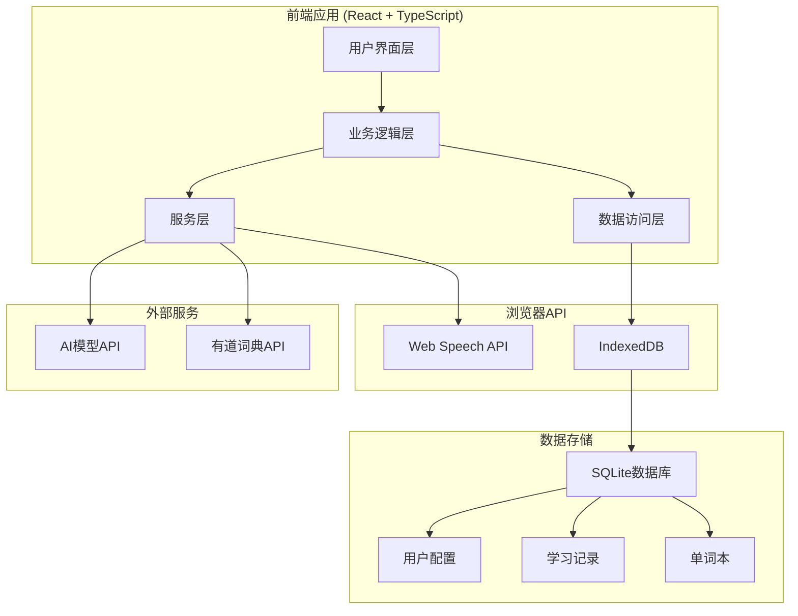
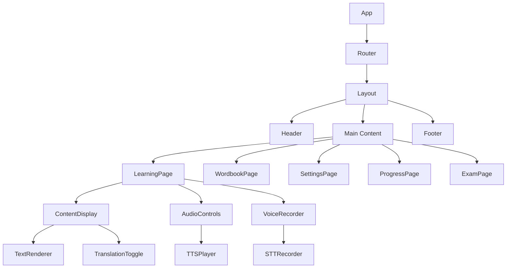

# 英语学习助手设计文档

## 概述

英语学习助手是一个基于现代Web技术栈构建的单页应用程序，采用Vite + React + TypeScript + Tailwind CSS + shadcn/ui架构。系统集成AI大语言模型、Web Speech API、SQLite数据库和有道词典API，为用户提供个性化的英语学习体验。

### 核心技术栈
- **前端框架**: React 18+ with TypeScript 5+
- **构建工具**: Vite
- **UI组件库**: shadcn/ui + Tailwind CSS
- **数据库**: SQLite (通过sql.js在浏览器中运行)
- **语音处理**: Chrome Web Speech API (SpeechSynthesis + SpeechRecognition)
- **AI集成**: OpenAI兼容API
- **包管理器**: Yarn

## 架构设计

### 系统架构图



### 分层架构

#### 1. 用户界面层 (UI Layer)
- **组件**: 基于shadcn/ui的可复用React组件
- **页面**: 学习主页、设置页面、单词本、成长报告、考试系统
- **响应式设计**: 适配PC端和移动端

#### 2. 业务逻辑层 (Business Logic Layer)
- **学习管理**: 内容生成、进度跟踪、水平评估
- **语音处理**: TTS/STT功能封装
- **单词管理**: 单词本维护、记忆曲线算法
- **考试系统**: 题目生成、评分逻辑

#### 3. 服务层 (Service Layer)
- **AI服务**: 与大语言模型的交互
- **语音服务**: Web Speech API封装
- **词典服务**: 有道词典API集成
- **存储服务**: 数据持久化管理

#### 4. 数据访问层 (Data Access Layer)
- **Repository模式**: 统一的数据访问接口
- **数据模型**: TypeScript接口定义
- **缓存管理**: 本地数据缓存策略

## 组件设计

### 核心组件架构



### 主要组件说明

#### 1. ContentDisplay 组件
- **功能**: 显示AI生成的学习内容
- **特性**: 支持原文/翻译切换、单词点击查询、句子/段落播放
- **响应式**: 适配不同屏幕尺寸的阅读体验

#### 2. AudioControls 组件
- **功能**: 音频播放控制
- **特性**: 整文播放、句子播放、单词播放、播放进度显示
- **状态管理**: 播放状态、当前位置、音量控制

#### 3. VoiceRecorder 组件
- **功能**: 语音录制和识别
- **特性**: 录音控制、实时反馈、发音评估
- **权限管理**: 麦克风权限请求和错误处理

#### 4. WordCard 组件
- **功能**: 单词本中的单词卡片
- **特性**: 单词信息展示、熟练度显示、复习提醒
- **交互**: 标记掌握、删除单词、查看详情

## 数据模型

### 数据库设计

```sql
-- 用户配置表
CREATE TABLE user_profile (
    id INTEGER PRIMARY KEY,
    english_level TEXT NOT NULL, -- A1, A2, B1, B2, C1, C2
    learning_goal TEXT NOT NULL,
    created_at DATETIME DEFAULT CURRENT_TIMESTAMP,
    updated_at DATETIME DEFAULT CURRENT_TIMESTAMP
);

-- AI模型配置表
CREATE TABLE ai_config (
    id INTEGER PRIMARY KEY,
    api_url TEXT NOT NULL,
    api_key TEXT NOT NULL,
    model_name TEXT NOT NULL,
    created_at DATETIME DEFAULT CURRENT_TIMESTAMP,
    updated_at DATETIME DEFAULT CURRENT_TIMESTAMP
);

-- 学习内容表
CREATE TABLE learning_content (
    id INTEGER PRIMARY KEY,
    content_type TEXT NOT NULL, -- 'dialogue', 'article'
    original_text TEXT NOT NULL,
    translation TEXT NOT NULL,
    difficulty_level TEXT NOT NULL,
    topic TEXT,
    created_at DATETIME DEFAULT CURRENT_TIMESTAMP
);

-- 单词本表
CREATE TABLE wordbook (
    id INTEGER PRIMARY KEY,
    word TEXT NOT NULL UNIQUE,
    definition TEXT NOT NULL,
    pronunciation TEXT,
    add_reason TEXT NOT NULL, -- 'translation_lookup', 'pronunciation_error', 'listening_difficulty'
    proficiency_level INTEGER DEFAULT 0, -- 0-5 熟练度等级
    review_count INTEGER DEFAULT 0,
    last_review_at DATETIME,
    next_review_at DATETIME,
    created_at DATETIME DEFAULT CURRENT_TIMESTAMP
);

-- 学习记录表
CREATE TABLE learning_records (
    id INTEGER PRIMARY KEY,
    activity_type TEXT NOT NULL, -- 'reading', 'listening', 'speaking', 'translation'
    content_id INTEGER,
    word TEXT,
    accuracy_score REAL,
    time_spent INTEGER, -- 秒
    created_at DATETIME DEFAULT CURRENT_TIMESTAMP,
    FOREIGN KEY (content_id) REFERENCES learning_content(id)
);

-- 考试记录表
CREATE TABLE exam_records (
    id INTEGER PRIMARY KEY,
    exam_type TEXT NOT NULL, -- 'vocabulary', 'pronunciation', 'comprehension'
    total_questions INTEGER NOT NULL,
    correct_answers INTEGER NOT NULL,
    score REAL NOT NULL,
    duration INTEGER NOT NULL, -- 秒
    created_at DATETIME DEFAULT CURRENT_TIMESTAMP
);
```

### TypeScript 接口定义

```typescript
// 用户配置接口
interface UserProfile {
  id: number;
  englishLevel: 'A1' | 'A2' | 'B1' | 'B2' | 'C1' | 'C2';
  learningGoal: string;
  createdAt: Date;
  updatedAt: Date;
}

// AI配置接口
interface AIConfig {
  id: number;
  apiUrl: string;
  apiKey: string;
  modelName: string;
  createdAt: Date;
  updatedAt: Date;
}

// 学习内容接口
interface LearningContent {
  id: number;
  contentType: 'dialogue' | 'article';
  originalText: string;
  translation: string;
  difficultyLevel: string;
  topic?: string;
  createdAt: Date;
}

// 单词接口
interface Word {
  id: number;
  word: string;
  definition: string;
  pronunciation?: string;
  addReason: 'translation_lookup' | 'pronunciation_error' | 'listening_difficulty';
  proficiencyLevel: number; // 0-5
  reviewCount: number;
  lastReviewAt?: Date;
  nextReviewAt?: Date;
  createdAt: Date;
}

// 学习记录接口
interface LearningRecord {
  id: number;
  activityType: 'reading' | 'listening' | 'speaking' | 'translation';
  contentId?: number;
  word?: string;
  accuracyScore?: number;
  timeSpent: number;
  createdAt: Date;
}

// 考试记录接口
interface ExamRecord {
  id: number;
  examType: 'vocabulary' | 'pronunciation' | 'comprehension';
  totalQuestions: number;
  correctAnswers: number;
  score: number;
  duration: number;
  createdAt: Date;
}
```

## 服务设计

### 1. AI服务 (AIService)

```typescript
interface AIService {
  generateContent(level: string, goal: string, type: 'dialogue' | 'article'): Promise<LearningContent>;
  generateExamQuestions(level: string, words: Word[]): Promise<ExamQuestion[]>;
  evaluatePronunciation(original: string, spoken: string): Promise<PronunciationScore>;
}
```

**功能**:
- 根据用户水平和目标生成学习内容
- 生成个性化考试题目
- 评估发音准确度

### 2. 语音服务 (SpeechService)

```typescript
interface SpeechService {
  speak(text: string, options?: SpeechOptions): Promise<void>;
  startRecognition(): Promise<string>;
  stopRecognition(): void;
  isSupported(): boolean;
}
```

**功能**:
- TTS文本转语音
- STT语音转文本
- 浏览器兼容性检测

### 3. 词典服务 (DictionaryService)

```typescript
interface DictionaryService {
  lookupWord(word: string): Promise<WordDefinition>;
  getWordPronunciation(word: string): Promise<string>;
}
```

**功能**:
- 调用有道词典API查询单词
- 获取单词发音和释义

### 4. 存储服务 (StorageService)

```typescript
interface StorageService {
  initDatabase(): Promise<void>;
  saveUserProfile(profile: UserProfile): Promise<void>;
  getUserProfile(): Promise<UserProfile | null>;
  addWordToBook(word: Word): Promise<void>;
  getWordsForReview(): Promise<Word[]>;
  recordLearningActivity(record: LearningRecord): Promise<void>;
}
```

**功能**:
- SQLite数据库初始化
- 用户数据CRUD操作
- 学习记录管理

## 错误处理

### 错误类型定义

```typescript
enum ErrorType {
  NETWORK_ERROR = 'NETWORK_ERROR',
  API_ERROR = 'API_ERROR',
  SPEECH_NOT_SUPPORTED = 'SPEECH_NOT_SUPPORTED',
  MICROPHONE_PERMISSION_DENIED = 'MICROPHONE_PERMISSION_DENIED',
  DATABASE_ERROR = 'DATABASE_ERROR',
  INVALID_CONFIG = 'INVALID_CONFIG'
}

interface AppError {
  type: ErrorType;
  message: string;
  details?: any;
}
```

### 错误处理策略

1. **网络错误**: 自动重试机制，显示离线提示
2. **API错误**: 友好的错误提示，配置验证
3. **语音API不支持**: 降级到文本模式，浏览器兼容性提示
4. **权限错误**: 权限请求引导，替代方案提供
5. **数据库错误**: 数据恢复机制，错误日志记录

## 测试策略

### 测试层次

1. **单元测试**
   - 组件测试 (React Testing Library)
   - 服务层测试 (Jest)
   - 工具函数测试

2. **集成测试**
   - API集成测试
   - 数据库操作测试
   - 语音功能测试

3. **端到端测试**
   - 用户流程测试 (Playwright)
   - 跨浏览器兼容性测试
   - 响应式设计测试

### 测试覆盖率目标
- 代码覆盖率: ≥80%
- 分支覆盖率: ≥75%
- 核心功能覆盖率: 100%

## 性能优化

### 前端优化
1. **代码分割**: 路由级别的懒加载
2. **组件优化**: React.memo、useMemo、useCallback
3. **资源优化**: 图片懒加载、字体优化
4. **缓存策略**: Service Worker、本地存储

### 数据库优化
1. **索引优化**: 为常用查询字段创建索引
2. **查询优化**: 避免N+1查询，使用批量操作
3. **数据清理**: 定期清理过期数据

### 语音功能优化
1. **音频缓存**: 缓存常用单词发音
2. **识别优化**: 设置合适的识别参数
3. **错误恢复**: 语音功能失败时的降级方案

## 安全考虑

### 数据安全
1. **API密钥保护**: 客户端加密存储
2. **用户数据**: 本地存储，不上传敏感信息
3. **输入验证**: 防止XSS和注入攻击

### 隐私保护
1. **语音数据**: 不存储用户语音录音
2. **学习记录**: 匿名化处理
3. **第三方API**: 最小化数据传输

## 部署架构

### 构建配置
- **开发环境**: Vite开发服务器，热重载
- **生产环境**: 静态文件构建，CDN部署
- **环境变量**: 不同环境的配置管理

### 浏览器兼容性
- **目标浏览器**: Chrome 80+, Firefox 75+, Safari 13+, Edge 80+
- **Polyfill**: 为不支持的API提供降级方案
- **渐进增强**: 核心功能在所有浏览器中可用

## 国际化支持

虽然当前版本主要支持中英文，但架构设计考虑了未来的国际化扩展：

1. **文本外化**: 使用i18n库管理多语言文本
2. **日期格式**: 支持不同地区的日期时间格式
3. **语音引擎**: 支持不同语言的TTS/STT
4. **内容生成**: AI模型支持多语言内容生成